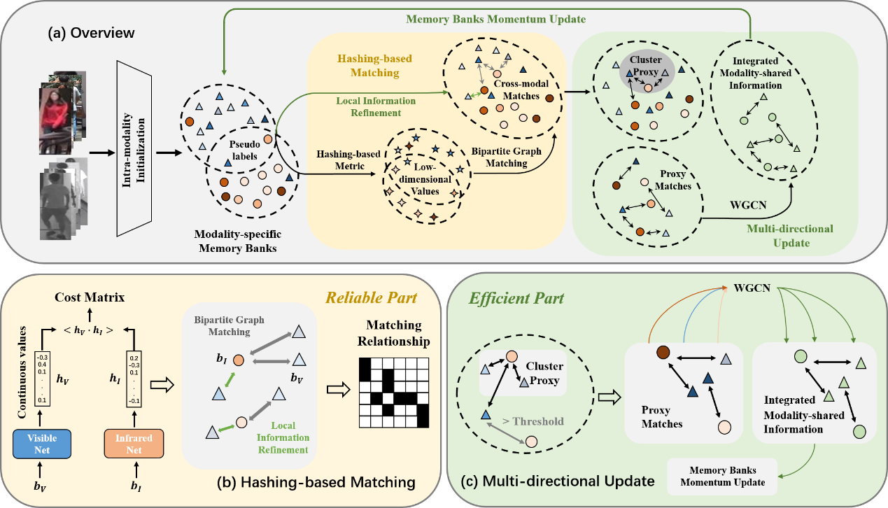
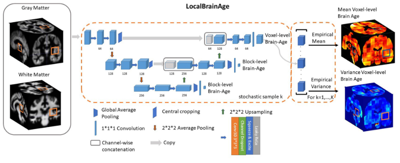
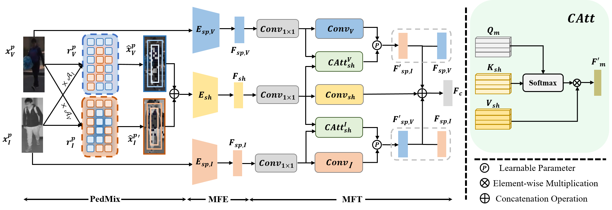
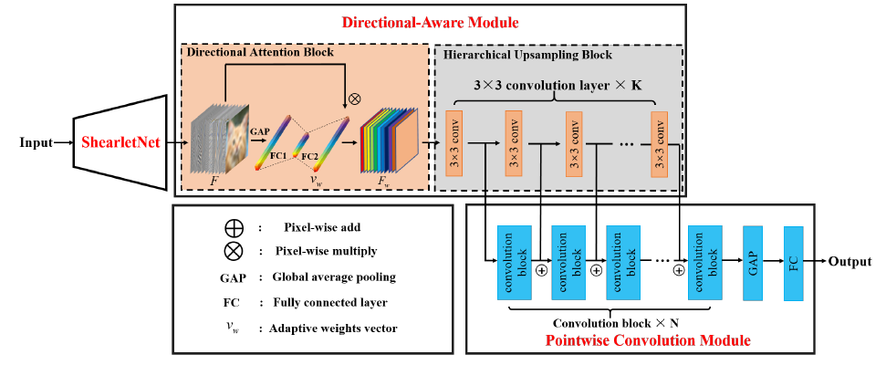

# BIOGRAPGHY

I am a Master's student at the School of Artificial Intelligence, Xidian University. I am set to obtain my Master's degree in **2025**, advised by Prof. **[Yuwei Guo](https://scholar.google.com/citations?user=DR-GIokAAAAJ&hl=en)**. For my undergraduate studies, I attended the School of Computer Science at Xidian University, achieving a GPA of **3.7**. During my master's program, I have actively contributed to four significant projects in **[Cross-Modal Person Re-identification (VI-ReID)](#renet-reliable-and-efficient-cross-modality-learning-for-unsupervised-visible-and-infrared-person-re-identification-usl-vi-reid)**, **[Brain Age Prediction](#a-6-month-internship-at-the-wan-lab-university-of-nebraska-medical-center)**, and **[Non-learned Operator based Deep Learning Models](#lightweight-directional-aware-network-for-classification)**. 

I intend to pursue a Ph.D. program in <strong>Fall 2025</strong> with a focus on Multi-Modal Learning, especially within the realms of AI for Human or Societal Benefit. You can reach me at <strong>zwhxd2@stu.xidian.edu.cn</strong> or <strong>zwhxidian@gmail.com</strong>.

  <a href="https://drive.google.com/file/d/1OxV8laQgOSKskp1Yb82IsPLtXmcxO342/view?usp=sharing">CV</a> /
  <a href="https://drive.google.com/file/d/1xcmToOxUO-5K4zOhtL1fv6155P-Do1jO/view?usp=sharing">Transcripts</a> /
  SOP

## EDUCATION AND QUALIFICATIONS

**Xidian University**    Artificial Intelligence (GPA 3.8/4.0)    M.S., 2025 (Expected)

**Xidian University**    Computer Science        (GPA 3.7/4.0)    B.S. 2022  

## RESEARCH EXPERIENCE

### 2024

### RENet: Reliable and Efficient Cross Modality Learning for Unsupervised Visible and Infrared Person Re-identification (USL-VI-ReID)
 
- Proposed Hashing-based Metric to reliably measure the cross-modal similarity, improving the Rank-1 accuracy by 2.39% compared to the commonly used distance metrics.
- Devised a Multi-directional Update module to efficiently bridge the modal gap, achieving SOTA performance.

### A 6-month Internship at the Wan Lab, University of Nebraska Medical Center
 
- Collaborated on advancing the project in predicting brain age using local image features of T1-MRI scans.
- Optimized and enhanced the Local U-Net for Brain Age Prediction by utilizing the Swin Transformer Block. The code has been open-sourced and is available at [Wan Lab](https://github.com/wan-mlab/Swin-U-NET).

### 2023

### Transferring Modality-Aware Pedestrian Attentive Learning for Visible-Infrared Person Re-Identification (VI-ReID)

- Proposed a data augmentation PedMix, tailored for VI-ReID, effectively improving the mean Average Precision (mAP) by 4.67%.
- Introduced a Modality Feature Transfer module, integrating cross-attention and convolution networks with minimum computational overhead, generating discriminative modality-complete features.
- Submission Update: AAAI 2024 (3 wa & 1 wr) to TCSVT. The preprint is available at [Publication](https://arxiv.org/abs/2312.07021).

### Lightweight Directional-Aware Network for Classification
 
- Conducted a comprehensive review of all non-learned operators-based Deep Learning models, providing a classification of current methods.
- Introduced a lightweight directional-aware network, achieving state-of-the-art performance at a significantly lower computational cost.
- Submitted to Artificial Intelligence Review. (Revision Submitted)

## PUBLICATIONS

- Yuwei Guo, **Wenhao Zhang**, Yupeng Gao, Licheng Jiao, Rong Qu, Shuang Wang, Fang Liu, Jiabo Du. (2024). Revisiting Non-Learned Operators Based Deep Learning: A Lightweight Directional-Aware Network for Classification. In Artificial Intelligence Review. (Revision Submitted)
  
- Yuwei Guo, **Wenhao Zhang**, Licheng Jiao, Jiabo Du, Shuo Wang, Shuang Wang and Liu Fang. (2024). Transferring Modality-Aware Pedestrian Attentive Learning for Visible-Infrared Person Re-identification. In IEEE Transactions on Circuits and Systems for Video Technology. (Under Review)
  
- Yuwei Guo, **Wenhao Zhang**, Jiabo Du, Licheng Jiao, Rong Qu, Shuang Wang, Fang Liu, Wei Zhan. (2024). RENet: Reliable and Efficient Cross Modality Learning for Unsupervised Visible and Infrared Person Re-identification.
  
- Yuwei Guo, Jiabo Du, Licheng Jiao, **Wenhao Zhang**, Shuo Wang, Shuang Wang and Liu Fang. (2023). Causal Consistency Model for Semi-supervised Classification. In Knowledge-based Systems. (Under Review)

**My current supervisor serves as the first author.**

## PATENTS

- Yuwei Guo, **Wenhao Zhang**, Jiabo Du, Wei Zhan. (2023). Cross-Modal Pedestrian Re-Identification Method Based on Spatial Data Augmentation and Symmetric Cross-Modal Attention. CN Patent, Application No. 202310838299.7.
  
- Yuwei Guo, Jiabo Du, **Wenhao Zhang**, Yupeng Gao. (2022). Causal Inference Based Semi-Supervised Image Classification Method. CN Patent, Application No. 202210896650.3.
  
- Yuwei Guo, Yupeng Gao, Jiabo Du, **Wenhao Zhang**. (2022). Image Classification Method based on Shearlet Networks and Directional Attention Mechanism. CN Patent, Application No. 202211044682.7.

## HONORS AND AWARDS
- Xidian First-Class Fellowship, Xidian University (2022-2023)
  
- Xidian Scholarship, Xidian University (2018-2022)
  
- Provincial First Prize in the 8th China International College Students ‘Internet+’ Innovation and Entrepreneurship Competition Skills (2022)
  
- Provincial Second Prize in the 7th China International College Students ‘Internet+’ Innovation and Entrepreneurship Competition Skills (2021)
